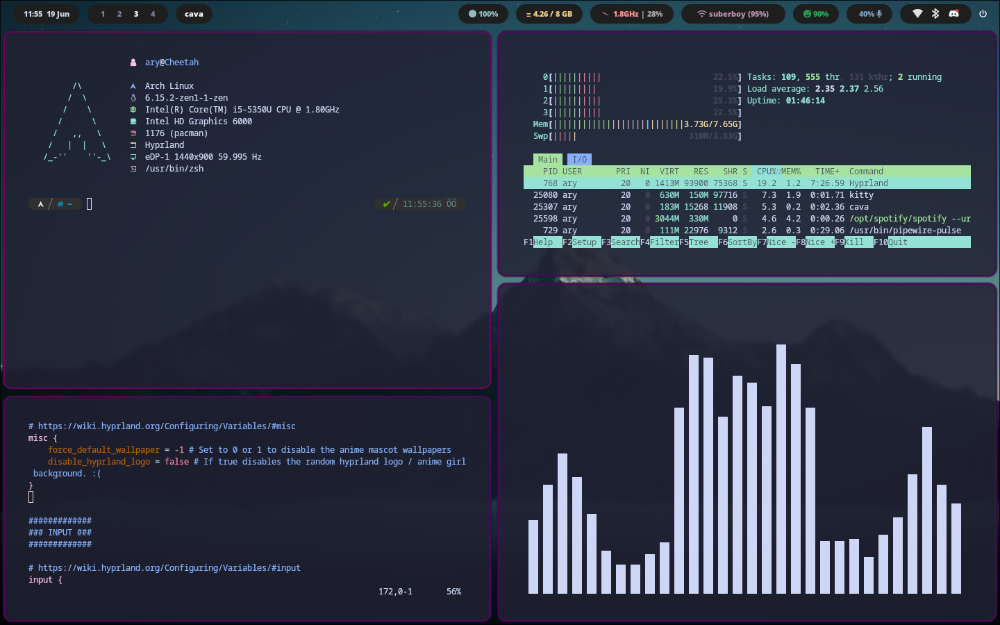

# Hyprdots
a git repo for my configuration files

# Screenshots



# Dependencies
- hyprland
- hyprpaper
- hyprlock
- hypridle
- hyprpicker (optional)
- vim
- cava
- waybar
- rofi
- nvim (optional)

# Installation
Clone the Repo and drop the configuration files in ```~/.config``` directory 

# Notes
The F-fetch is Rust-powered very fast system fetcher. 
For more information, go to https://github.com/0l3d/ffetch
